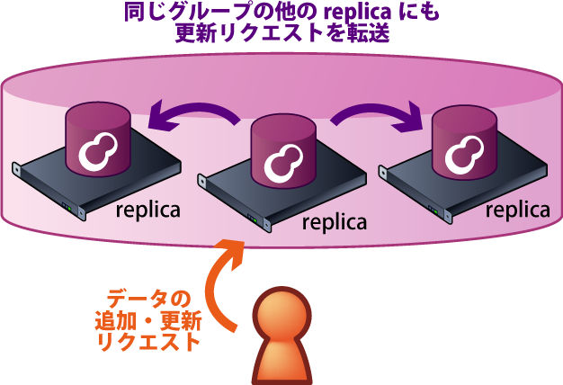
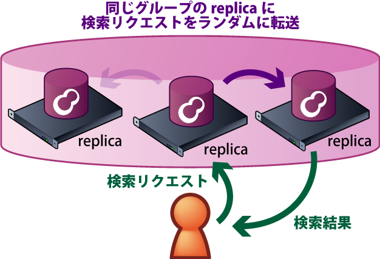
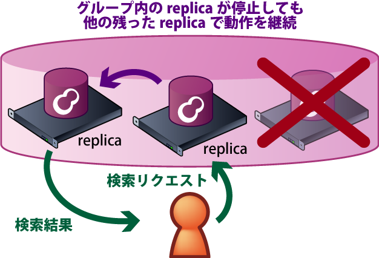
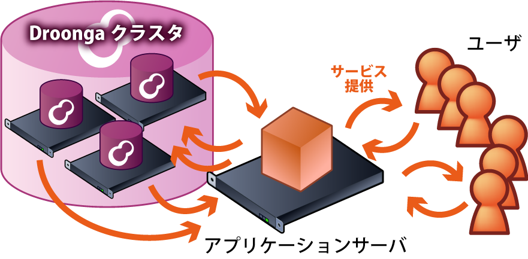
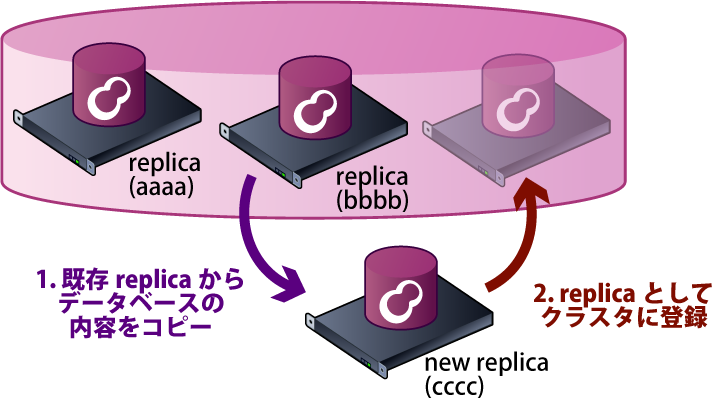
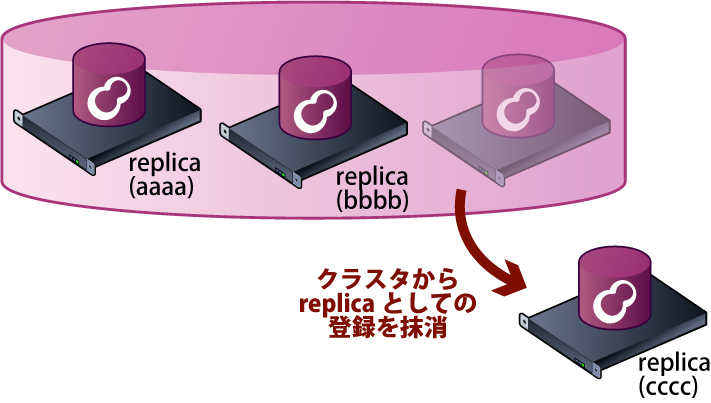

# Droonga

subtitle
:   　　
    分散Groongaで
    快適レプリケーション生活

author
:   結城洋志

institution
:   株式会社クリアコード

allotted_time
:   30m

theme
:   groonga

# Droongaって？

*D*istributed G*roonga*

# 要旨

 * 1年間の*進捗報告*
 * *「分散Groonga」としての
   Droongaの現状*の紹介

# Part1

1年間の
*進捗報告*

# 昨年からの進捗

昨年の
「全文検索エンジンGroongaを囲む夕べ4」
での発表から
*どこまで進んだのか？*
*どう変わったのか？*

# 昨年の発表

 * 設計方針
 * 実装
 * （当時の）現状
 * （当時の）今後の予定

# 大まかに言って

*汎用の*分散型
データ処理エンジンとして

 * こういう設計でこう動きます！
 * こういう事も
   *やろうと思えばできます*！

という話が主

# 大まかに言って

*今、こう使えます*
という話は
あんまり無かった

# なんで？

 * どっちかというと
   *フレームワーク的*な物だった
 * *プリミティブすぎ*て
   具体的な実用形態が遠い
 * *具体的な用途*を先に
   決めないと話が始まらない

# ハードル高すぎ

{:relative_height="95"}

# しかも

 * 設計を*熟知*した人が
 * 用途ごとの*最適な構成*を考え
   * ログ保存＆検索用？
   * 掲示板のバックエンド用？
 * 丁寧な*手作業*でひとつひとつ
   セットアップ＆設定

# 職人芸

{:relative_height="95"}

# ユーザにとって

 * 誰でも*気軽に*利用できる
   ようにはなっていなかった

# 開発者にとって

 * *やらなきゃいけない事*が
   膨大すぎ＆どんどん増える
   * 作業を進める度に
     *「あ、これもやっとかなきゃ」*
     と課題が明らかになってくる
 * *どこから手を着ければいいのか*
   分からない

# 人、それを炎上と云う

{:relative_height="95"}

# 方針転換

 * Droonga側である程度
   *典型的な用途*を想定する
 * その用途で使おうとした時の
   *躓きポイント*を潰していく

# 何に使いたい？

とりあえず
*分散対応の
Groonga*
として使いたい

# なら、やるべき事は明確

 * *Groongaとの互換性*を向上
 * *簡単インストール＆
   セットアップ*を実現
 * ユーティリティの整備により
   *簡単クラスタ管理*を実現

# その過程で

 * *オーケストレーション*導入
   （based on Serf）
   * 一部のノードが死んでも
     クラスタとして動作し続ける
 * 検索処理の最適化

# 結果（現状）

*レプリケーション
できるGroonga*
としてそこそこ
形になってきた！

# Part2

*「分散Groonga」*
としての
Droongaの紹介

# 特徴

特徴

# Groonga互換

{:relative_height='95'}

# データベースを分散

 * *レプリケーション*
   * 現在の開発はここに注力
 * *パーティショニング*
   * 現在は部分的に対応（これから改善）

# レプリケーション

{:relative_width="35" align="left" relative_margin_left="-20"}

{:relative_width="45" align="right"}

# レプリケーションの利点(1)

{:relative_height='90'}

# レプリケーションの利点(1)

{:relative_height='90'}

# レプリケーションの利点(1)

{:relative_height='90'}

# レプリケーションの利点(2)

{:relative_height='90'}

# レプリケーションの利点(2)

{:relative_height='90'}

# 実際の性能は？

Groonga v.s. Droonga
ベンチマーク

 * Wikipedia日本語版
   *150万ページ*
 * *全文検索*＋*ドリルダウン*
 * キャッシュヒット率50％

# 実際の性能：スループット

（グラフ）

# 実際の性能：レイテンシー

（グラフ）

# 性能の傾向

 * 条件次第では
   *ほとんど性能劣化無し*！
 * ノード追加で
   *スループットの上限UP*！

# 試してみよう

 * ノードをセットアップ
 * サービスを起動
 * Groongaのselectコマンドで
   全文検索
 * クラスタにノードを追加

# ノードのセットアップ

インストールスクリプト
（Ubuntu、CentOS7のみ対応）

    # curl \
        https://raw.githubusercontent.com/droonga/droonga-engine/master/install.sh | \
        bash
    # curl \
        https://raw.githubusercontent.com/droonga/droonga-http-server/master/install.sh | \
        bash

# サービスの起動

serviceコマンドを使用

    # service droonga-engine start
    # service droonga-http-server start

# サービスの終了

serviceコマンドを使用

    # service droonga-engine stop
    # service droonga-http-server stop

# 検索とか

GroongaのHTTPインターフェースと
互換性あり

    curl "http://hostname:10041/d/select?..."

# クラスタへのノード追加

    % droonga-engine-join --host=cccc \
                          --replica-source-host=bbbb

{:relative_height='100'}

# ノードの切り離し

    % droonga-engine-unjoin --host=cccc

{:relative_height='100'}

# これからのDroonga

 * Groongaとの互換性向上
   * *Suggest*対応
 * 分散対応の改善
   * 完全*無停止*でのクラスタ構成変更
   * *パーティショニング*有りの構成
   * *プラグイン開発*をより容易に

# 株式会社クリアコード

 * Groonga有償サポート
 * Mozilla有償サポート

# おわり

*Droonga, Groonga, 
株式会社クリアコード*
を宜しくお願いします

 * 使用画像
   * [写真素材 足成：秋葉原](http://www.ashinari.com/2009/07/12-024265.php)
   * [職人のおじいちゃん by Neil_Scottuk](http://free-photos.gatag.net/2014/07/06/100000.html)
   * [フリー画像・写真素材集 GATAG](http://free-photos.gatag.net/2014/11/10/170000.html)

