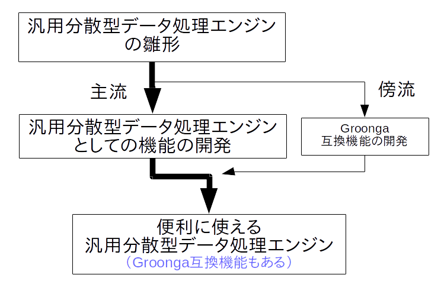
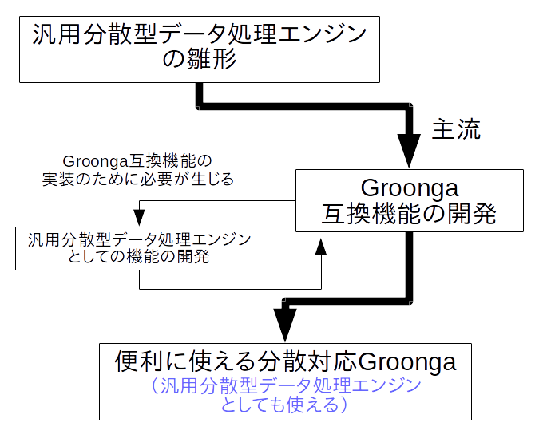
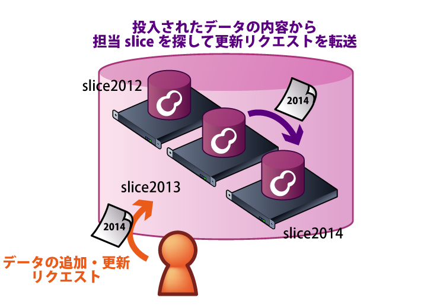
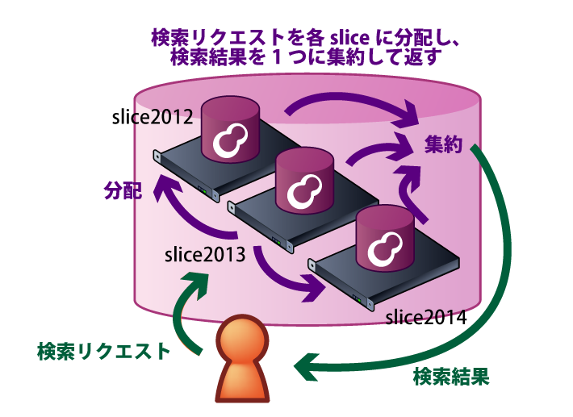
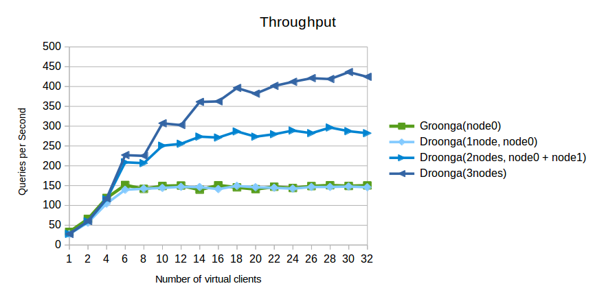
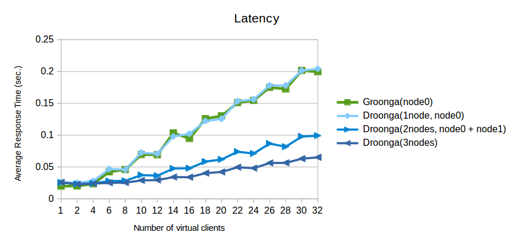

# Droonga

subtitle
:   　　
    分散Groongaで
    快適レプリケーション生活

author
:   結城洋志

institution
:   株式会社クリアコード

allotted_time
:   30m

theme
:   groonga

# Droongaって？

*D*istributed G*roonga*

# 要旨

 * 1年間の*進捗報告*
 * *「分散Groonga」としての
   Droongaの現状*の紹介

# ちょっと待って！

 * *分散Groonga*ってどゆこと？
 * *分散データ処理エンジン*
   じゃなかったの？

# 今日の話

 * 話すこと
   * 分散型データ処理エンジン
     *「Droonga」*の
   * 組み込みプラグインの1つ
     *「Groongaプラグイン」*
 * 話さないこと
   * Droongaの*設計*のこととか

# Part1

-Part1-
1年間の
*進捗報告*

# 昨年の発表

 * 設計方針
 * 実装
 * （当時の）現状
 * （当時の）今後の予定

# 大まかに言って

 * *汎用の*分散型
   データ処理エンジンとして
 * 「こういう設計でこう動きます」
   * SPOF無しとか
 * 「こういう事も
   *やろうと思えばできます*」
   * Push型のAPIとか

# 大まかに言って

*今、こう使えます*
という話は
あんまり無かった

# なんで？

 * どっちかというと*フレームワーク*
 * *プリミティブすぎ*て
   実用までが遠い
 * *具体的な用途*を先に
   決めないと話が始まらない

# ハードル高すぎ

{:relative_height="95"}

# しかも

 * 設計を*熟知*した人が
 * 用途ごとの*最適な構成*を考え
   * ログ保存＆検索用？
   * 掲示板のバックエンド用？
 * 丁寧な*手作業*でひとつひとつ
   セットアップ＆設定

# 職人芸

{:relative_height="95"}

# 問題：ユーザにとって

 * 事前知識無しだと
   *気軽*には利用できない
 * 開発が進んでもその状況は
   なかなか変わらない（見込み）
 * *Groongaユーザ*が馴染みにくい
   * 検索クエリが非互換
   * テーブルの定義の仕方等も違う

# 問題：開発者にとって

 * 汎用の便利な仕組みを作るには
   *膨大な作業が必要*
 * 開発が進んでも一般のユーザに
   *試してもらいにくい*
 * *Groongaユーザ*を長く放置
   することになる

# 当初の開発方針

{:relative_height="95"}

# 具体的な目標を設定

{:relative_height="95"}

# 目標設定の前後で

 * 変わらないこと
   * 最終的に作る*物*
 * 変わったこと
   * 作る*順番*
   * プロジェクト外への*見せ方*

# ここまでの成果(1)

 * *Groongaとの互換性*を向上
 * *簡単インストール＆
   セットアップ*を実現
 * ユーティリティの整備により
   *簡単クラスタ管理*を実現
 * *チュートリアル*の充実

# ここまでの成果(2)

 * *オーケストレーション*導入
   （based on Serf）
   * 一部のノードが死んでも
     クラスタとして動作し続ける
 * 検索処理の最適化

# つまり

*レプリケーション
できるGroonga*
としてそこそこ
形になってきた

# Part2

-Part2-
*「分散Groonga」*
としての
Droongaの紹介

# 特徴

特徴

# Groonga互換

{:relative_height='95'}

# データベースを分散

 * *レプリケーション*
   * 現在の開発はここに注力
 * *パーティショニング*
   * 現在は部分的に対応（これから改善）

# レプリケーション

{:relative_width="35" align="left" relative_margin_left="-20"}

{:relative_width="45" align="right"}

システムの冗長性や
耐障害性が高まる

# パーティショニング

{:relative_width="40" align="left" relative_margin_left="-20"}

{:relative_width="50" align="right"}

より多くの量のデータを管理できる

# 実際の性能は？

Groonga v.s. Droonga
ベンチマーク

 * Wikipedia日本語版
   *150万ページ*
 * *全文検索*＋*ドリルダウン*
 * キャッシュヒット率50％
 * [詳細はリポジトリを参照](https://github.com/droonga/presentation-groonga-night-5-droonga-as-groonga-with-replication/tree/master/benchmark)

# スループットの比較

{:relative_height='95'}

# レイテンシーの比較

{:relative_height='95'}

# 性能の傾向

 * *スループット性能*は良好
 * *レイテンシー*は若干あるが
   同時接続数が多いと性能が逆転
 * ノード追加で*Groongaの
   性能上の限界*を超えられる

# これからのDroonga

 * Groongaとの互換性向上
   * *Suggest*対応
 * 汎用の分散データ処理エンジン
   としての改善
   * 完全*無停止*でのクラスタ構成変更
   * *パーティショニング*有りの構成
   * *プラグイン開発*をより容易に

# まとめ

まとめ

# まとめ

 * Droongaは*汎用の
   分散型データ処理エンジン*
 * 組み込みのプラグインによって
   *レプリケーションできる
   Groonga*として使える

# 試してみよう

Droongaを
試してみよう

# 試してみよう

 * インストールと起動
 * Groongaからのデータ移行
 * Groongaアプリケーションの
   バックエンドを
   Droongaに切り替え
 * クラスタにノードを追加

# ノードのセットアップ

インストールスクリプト
（Ubuntu、CentOS7のみ対応）

    # curl \
        https://raw.githubusercontent.com/droonga/droonga-engine/master/install.sh | \
        bash
    # curl \
        https://raw.githubusercontent.com/droonga/droonga-http-server/master/install.sh | \
        bash

# サービスの起動

serviceコマンドを使用

    # service droonga-engine start
    # service droonga-http-server start

# サービスの終了

serviceコマンドを使用

    # service droonga-engine stop
    # service droonga-http-server stop

# データの移行

    % sudo gem install rroonga grn2drn droonga-client

    % grndump --no-dump-tables /path/to/groonga/db | \
          grn2drn | \
          droonga-send --server=node0 \
                       --report-throughput)
    % grndump --no-dump-schema --no-dump-indexes \
              /path/to/groonga/db | \
          grn2drn | \
          droonga-send --server=node0 \
                       --server=node1 \
                       --server=node2 \
                       ...
                       --report-throughput)

# アプリケーションの移行

GroongaのHTTPインターフェースと
互換性あり

    curl "http://hostname:10041/d/select?..."

アプリケーションは接続先を
Droongaに変えるだけでOK

# クラスタへのノード追加

    % droonga-engine-join --host=cccc \
                          --replica-source-host=bbbb

{:relative_height='100'}

# ノードの切り離し

    % droonga-engine-unjoin --host=cccc

{:relative_height='100'}

# 再度まとめ

 * Droongaは*汎用の
   分散型データ処理エンジン*
 * 組み込みのプラグインによって
   *レプリケーションできる
   Groonga*として使える
 * HTTPインターフェースは
   *Groongaと互換性有り*

# 宣伝

宣伝

# 株式会社クリアコード

 * *Groonga有償サポート*
   * Groonga以外のGroonga族も
 * Mozilla有償サポート
   * Firefox, Thunderbird, Firefox OS
 * その他OSS開発全般
 * *コードリーダー育成支援*

# 個人の活動

*日経Linux*誌にて

シェルスクリプト
解説マンガ
*「#!シス管系女子」*
こっそり連載中

{:relative_width="30" align="right" relative_margin_right="-10"}

# おわり

*Droonga, Groonga, 
株式会社クリアコード*
を宜しくお願いします

 * 使用画像
   * [写真素材 足成：秋葉原](http://www.ashinari.com/2009/07/12-024265.php)
   * [職人のおじいちゃん by Neil_Scottuk](http://free-photos.gatag.net/2014/07/06/100000.html)

